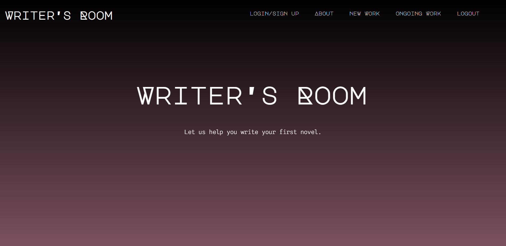
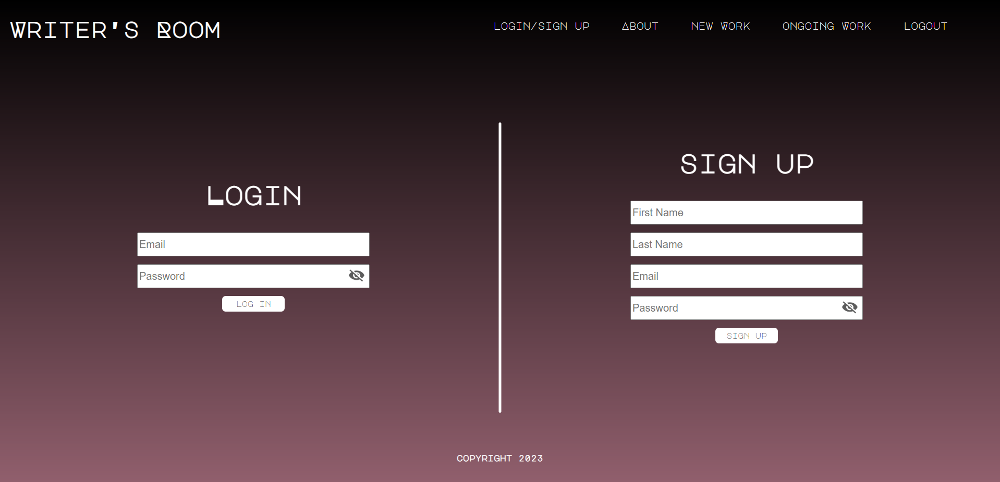
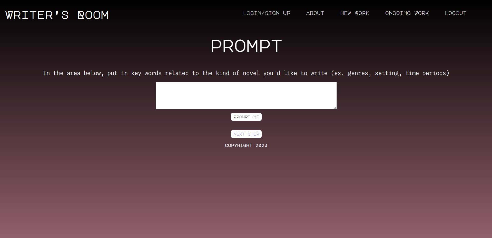

# Writers Room

## Table of Contents

1. [Description](#description)
2. [Usage](#usage)

3. [Contributing](#contributing)

4. [License](#license)

5. [Questions](#questions)

## Description

Writers Room is a website geared towards assisting writers to jump start their novels/story ideas. It provides prompts that engage the writer and provide useful elements to help get started.

## Usage

Visit website, Sign up or login, Choose New Work or Ongoing Work. Follow the Prompts if choosing the New Work option.

## Contributing

We're not accepting contributions at this time. If that changes, we'll be sure to update this section with additional information.

## License

This project is licensed under the [MIT](https://opensource.org/licenses/MIT) license.

## Questions

Find us on GitHub: [Jared Stratton](https://github.com/EliteHuskie)
                   [Nikki Vigneault](https://github.com/nikkivno)
                   [Sarah Stone](https://github.com/stms15)
                   [Scott Ogrins](https://github.com/scoges)

Contact us at: [Jared Stratton](mailto:EliteHuskie@gmail.com)
               [Nikki Vigneault](mailto:nikkivigneault@gmail.com)
               [Sarah Stone](mailto:stms15@mun.ca)
               [Scott Ogrins](mailto:scott.ogrins@gmail.com)