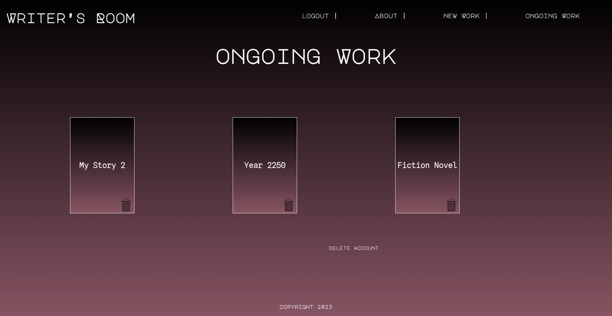
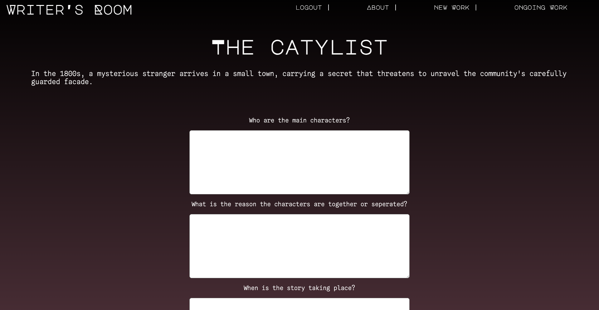
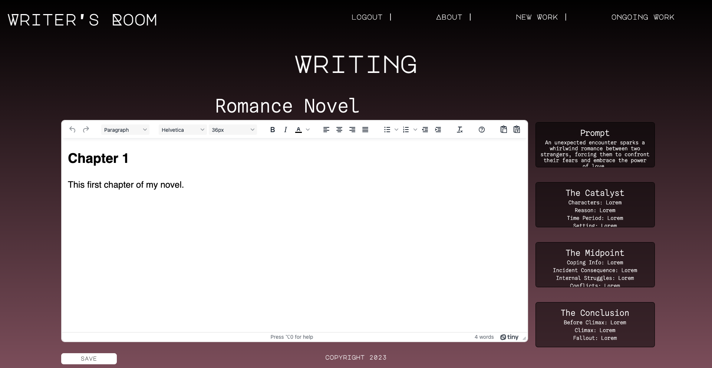

# Writers Room

## Table of Contents

1. [Description](#description)

2. [Usage](#usage)

3. [Contributing](#contributing)

4. [License](#license)

5. [Questions](#questions)

## Description

Writer's Room is a website geared towards assisting writers to jump start their novels/story ideas. It provides writing prompts that engage the writer and provide useful elements to help get started. You can use Writer's Room to write your entire novel from start to finish.

Technologies used: React, Node, MongoDB, OpenAI, JWT

## Usage

Visit the website and sign up or login to try our app. Link: https://writers-room-2023-1fe71a40c61d.herokuapp.com/

After loggin in, you can choose an existing work (if any) to keep working on or click "New Work" in the navigation to start the writing process for a new idea. If you want to delete an existing novel, just click the "trash" icon. You can also delete your entire account from this screen.

The "New Work" link will take you to the prompt page first to request an AI generated writing prompt powered by OpenAI. Type any keywords you want your novel to be about in the textbox and click "Prompt Me". You can continue generating a new prompt by click the "Prompt Me" button or change the keywords if you're not satisified with the results. When you're happy with your prompt, continue to the next page.

The next step will take you through answering some questions about the the beginning of your novel. Enter input in the text fields and click save at the bottom of the page before continuing to the next step.

The next two steps work similarly to the catalyst page but are centred around the midpoint and the climactic ending. Once you're finished with all three steps and have saved your input, you can click "Get Writing!" to start writing your novel.

Here you can name your novel and use the text editor to write your entire novel. Your answers to the previous questions are saved next to the text editor for your reference at any time during the writing process.

## Contributing

We're not accepting contributions at this time. If that changes, we'll be sure to update this section with additional information.

## License

This project is licensed under the [MIT](https://opensource.org/licenses/MIT) license.

## Questions

Find us on GitHub: [Jared Stratton](https://github.com/EliteHuskie)
[Nikki Vigneault](https://github.com/nikkivno)
[Sarah Stone](https://github.com/stms15)
[Scott Ogrins](https://github.com/scoges)

Contact us at: [Jared Stratton](mailto:EliteHuskie@gmail.com)
[Nikki Vigneault](mailto:nikkivigneault@gmail.com)
[Sarah Stone](mailto:stms15@mun.ca)
[Scott Ogrins](mailto:scott.ogrins@gmail.com)

---

## Badges

